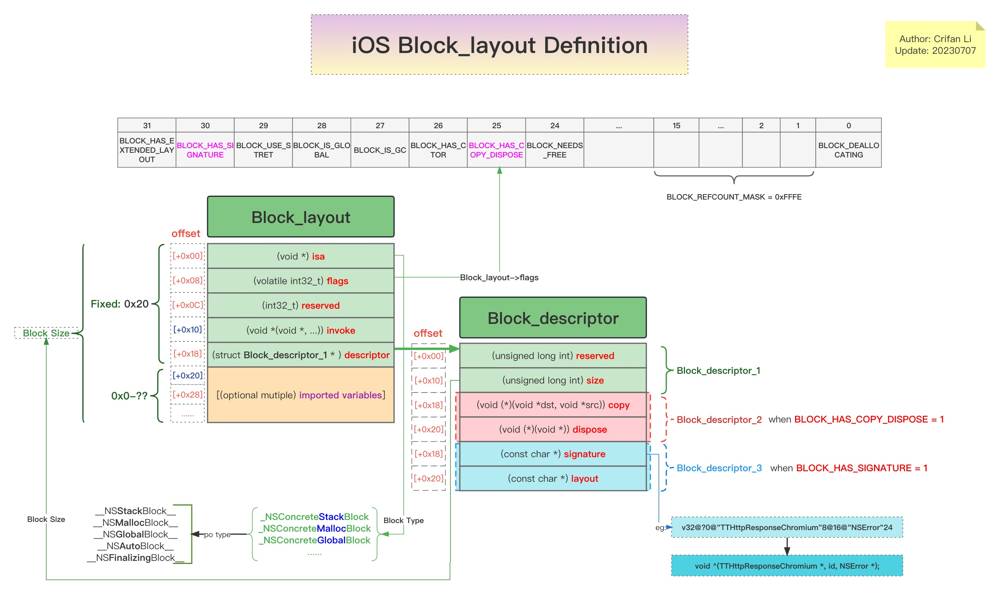
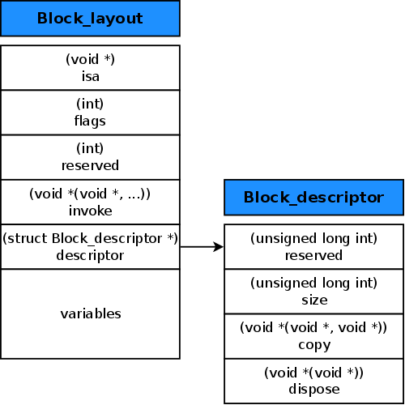

# Block定义

TODO：

* 【记录】iOS中的Block的定义画出结构图

---

## Block结构体定义

* 来源=官网源码
  * Block_private.h
    * 旧：https://opensource.apple.com/source/libclosure/libclosure-38/Block_private.h
    * 新：https://opensource.apple.com/source/libclosure/libclosure-63/Block_private.h
  * TODO：更新版，记得还有额外的属性，抽空也去整理过来

-> 合并后的最新的理解：

### Block定义的代码

```c
struct Block_layout {
    void *isa;
    volatile int32_t flags; // contains ref count
    int32_t reserved;
    void (*invoke)(void *, ...);
    struct Block_descriptor_1 *descriptor;
    // imported variables
};

// merged new layout
struct Block_descriptor {
    // Block_descriptor_1
    uintptr_t reserved;
    uintptr_t size;

    // Block_descriptor_2
    // requires BLOCK_HAS_COPY_DISPOSE
    void (*copy)(void *dst, const void *src);
    void (*dispose)(const void *);

    // Block_descriptor_3
    // requires BLOCK_HAS_SIGNATURE
    const char *signature;
    const char *layout;     // contents depend on BLOCK_HAS_EXTENDED_LAYOUT
};
```

### Block定义的结构图

* 自己的详细图
  * 
    * 在线浏览
      * [iOS的Block定义的结构图 | ProcessOn免费在线作图,在线流程图,在线思维导图](https://www.processon.com/view/link/6293498c0e3e74603c4b2039)
* 别人的简单的图
  * 

TODO：

* 【整理】iOS逆向心得：ObjC中Block的定义
