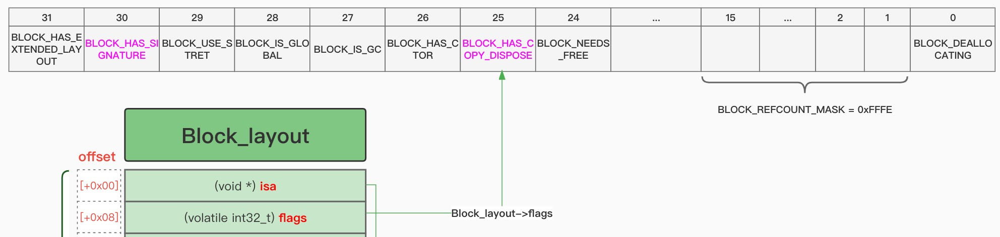

# flags

Block中的`flags`是个`标签`，一个int型数值，不同的位`bit`表示不同的含义。

具体定义：

[Block_private.h](https://opensource.apple.com/source/libclosure/libclosure-63/Block_private.h)

```c
// Values for Block_layout->flags to describe block objects
enum {
    BLOCK_DEALLOCATING =      (0x0001),  // runtime
    BLOCK_REFCOUNT_MASK =     (0xfffe),  // runtime
    BLOCK_NEEDS_FREE =        (1 << 24), // runtime
    BLOCK_HAS_COPY_DISPOSE =  (1 << 25), // compiler
    BLOCK_HAS_CTOR =          (1 << 26), // compiler: helpers have C++ code
    BLOCK_IS_GC =             (1 << 27), // runtime
    BLOCK_IS_GLOBAL =         (1 << 28), // compiler
    BLOCK_USE_STRET =         (1 << 29), // compiler: undefined if !BLOCK_HAS_SIGNATURE
    BLOCK_HAS_SIGNATURE  =    (1 << 30), // compiler
    BLOCK_HAS_EXTENDED_LAYOUT=(1 << 31)  // compiler
};

struct Block_layout {
...
    volatile int32_t flags; // contains ref count
...
};
```

详见整理的[Block结构图](http://book.crifan.org/books/ios_re_objc_block/website/block_detail/)中的定义：



## reference引用

```c
    // 3
    if (aBlock->flags & BLOCK_NEEDS_FREE) {
        // latches on high
        latching_incr_int(&aBlock->flags);
        return aBlock;
    }
```

> If the block’s flags includes BLOCK_NEEDS_FREE then the block is a heap block (you’ll see why shortly). In this case, all that needs doing is the reference count needs incrementing and then the same block returned.

如果flags中有BLOCK_NEEDS_FREE，则意味着：是个heap的block，即类型是`_NSConcreteMallocBlock`

```c
    // 8
    result->isa = _NSConcreteMallocBlock;
```

> Here the block’s isa pointer is set to be _NSConcreteMallocBlock, which means it’s a heap block

最后设置为：`_NSConcreteMallocBlock`
