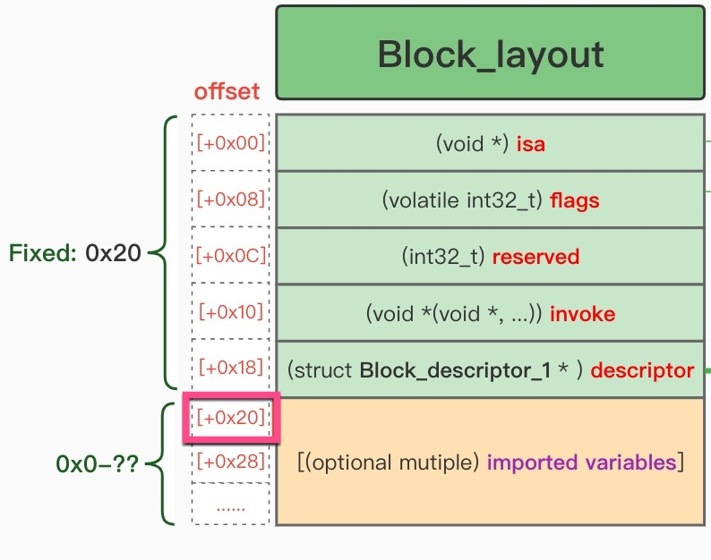

# imported variables

TODO：

* 【已解决】iOS逆向心得：Block的invoke函数调用时的函数参数
* 【整理】iOS逆向心得：Block被调用时的函数参数
* 【已解决】研究抖音关注逻辑：Block函数调用时的参数传递逻辑之sub_93413B8调用sub_9341898
  * 举例
    * 【未解决】研究抖音关注逻辑：sub_93413B8调用___lldb_unnamed_symbol583654即sub_9341898的调用逻辑
* 计算（引用的变量）参数的个数
  * 【已解决】iOS逆向心得：Block中能否和如何计算invoke函数的参数的个数
* 

---

Block是通过`imported variables`=`引用变量`，去实现参数传递的。

* 最新的理解：parameters vs imported variables
  * parameters
    * Block（的invoke函数）被调用时，传入的各个参数
      * x0=Block本身
      * x1、x2、x3等等：才是invoke函数的参数
  * imported variables
    * Block中的额外引用的变量 的叫法：
      * Block中0x20之后额外引用的变量
        * 
      * 标准叫法=Block定义中的注释的说法：imported variables = 导入的变量
        * =Block引用的变量
        * =Block额外引用的变量
        * =Block额外的参数

* Block所引用的变量
  * 
