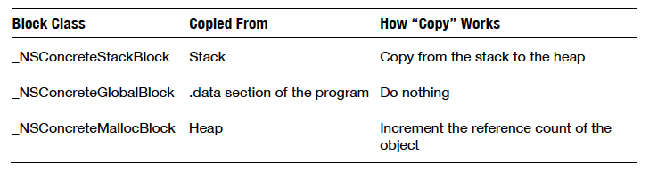
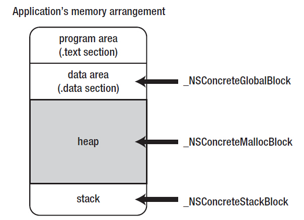
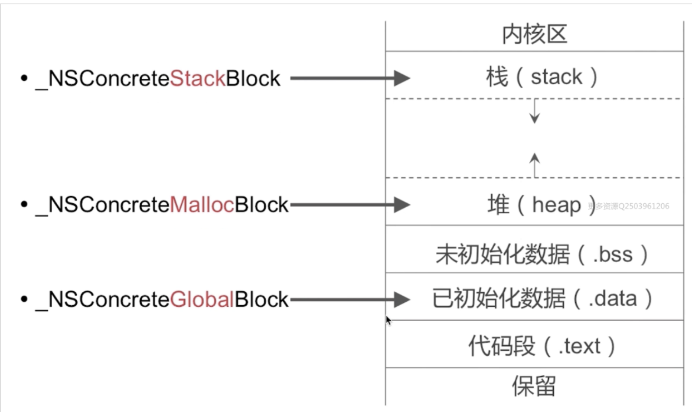

# Block类型

Block有多种类型：

* Block类型
  * 大类：3类
    * `global`
    * `malloc`
    * `stack`
  * 具体：[很多种](https://opensource.apple.com/source/libclosure/libclosure-79/data.m.auto.html)
    * `_NSConcreteGlobalBlock`
    * `_NSConcreteMallocBlock`
    * `_NSConcreteStackBlock`
    * `_NSConcreteAutoBlock`
    * `_NSConcreteFinalizingBlock`
    * 其他相关
      * `_NSConcreteWeakBlockVariable`
* 最常见的3种Block类型
  * 文字
    * `_NSConcreteGlobalBlock`
    * `_NSConcreteMallocBlock`
    * `_NSConcreteStackBlock`
  * 图
    * 
    * 
    * 
  * Block类型识别和转换
    * 访问了auto变量的block是`__NSStackBlock__`类型
    * 没有访问auto变量的block是`__NSGlobalBlock__`类型
    * 而对`__NSStackBlock__`类型进行copy操作就会变为`__NSMallocBlock__`类型

iOS逆向中，IDA伪代码中最常看到的是：`_NSConcreteStackBlock`。
