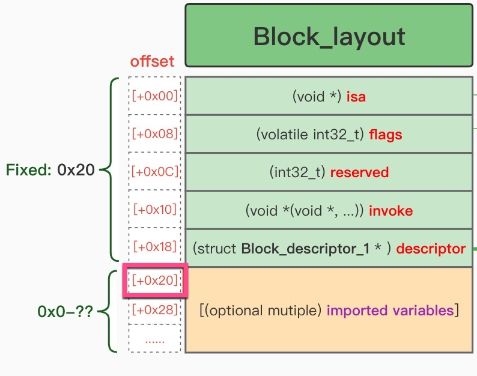

# Block分析实例

## Block最核心的部分

iOS逆向期间，和搞懂代码逻辑相关的，所涉及到的Block机制最核心的部分是

* `invoke` = 调用了什么函数
  * 知道A函数调用了B函数
    * 明白后续会调用到B函数 = B函数后续会同步或异步执行
* `imported variables` = 额外传入了什么参数
  * `imported variables`=`引用的变量`=`导入的变量`=`额外传入的参数`
    * A函数调用B函数，往往有些额外的参数，由于是匿名函数，无法像普通函数调用传递参数，所以底层实现机制是，在`descriptor`之后，按照顺序去摆放所`引用的参数`=`导入的变量`=`imported variables`
      * 具体的说就是，在`block+0x20`之后，可能有0或多个，引用的参数
        * 
