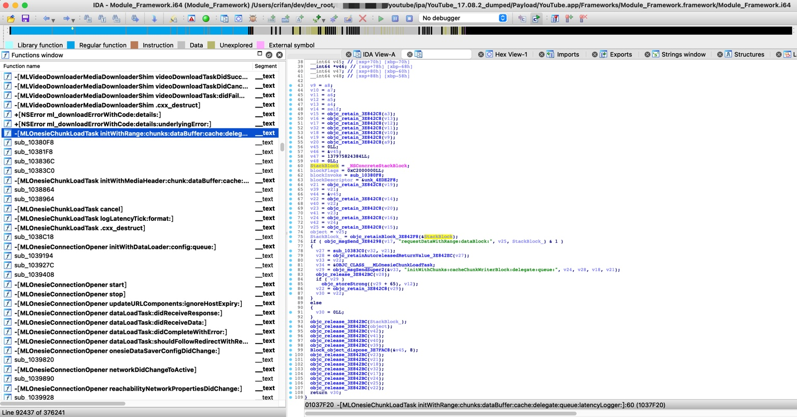
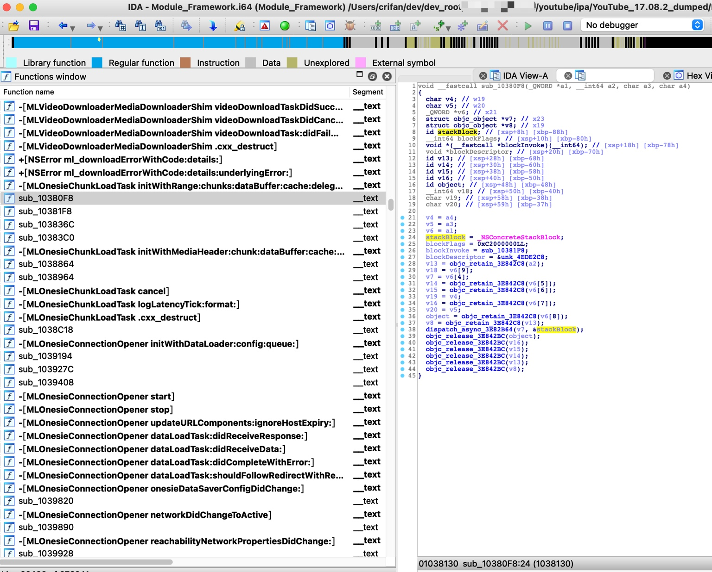
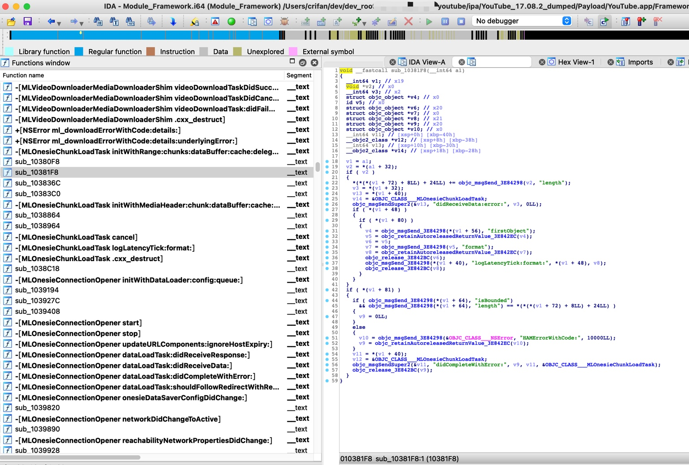
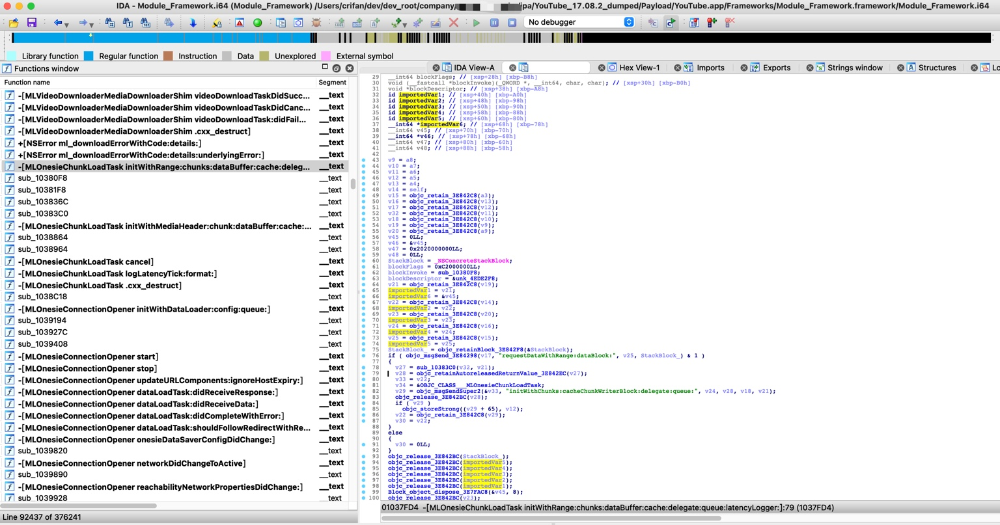
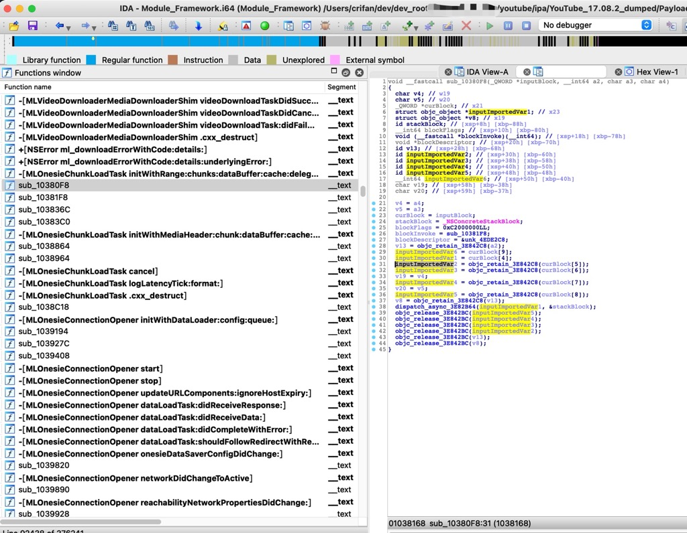
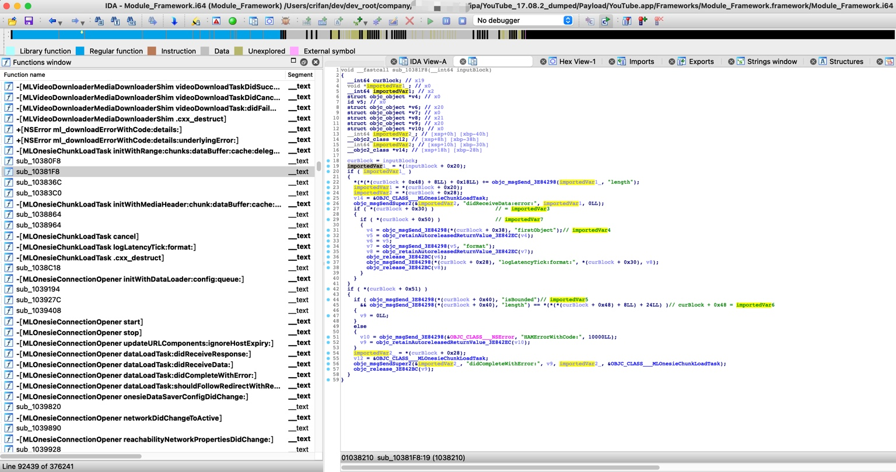
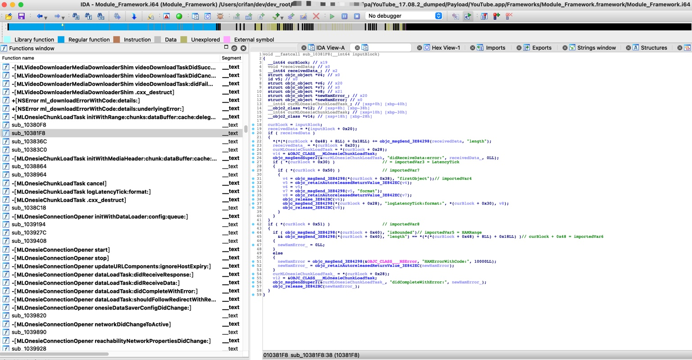

# YouTube逆向

此处通过具体实例来说明：

iOS逆向`YouTube`期间，如何搞懂`Block`异步函数调用，包括如何传递参数`引用变量`=`imported variables`。

YouTube的函数调用逻辑是：

```bash
当 去掉广告过滤 时，调用到 MLServerABRLoader onesieDataLoader:didCompleteChunks:withError: 的顺序：

-[MLOnesieChunkLoadTask initWithRange:chunks:dataBuffer:cache:delegate:queue:latencyLogger:]
    sub_10380F8 = -[MLOnesieChunkLoadTask initWithRange:chunks:dataBuffer:cache:delegate:queue:latencyLogger:]_block
        sub_10381F8 = -[MLOnesieChunkLoadTask initWithRange:chunks:dataBuffer:cache:delegate:queue:latencyLogger:]_block_block + 344 = 
            -[HAMBaseChunkLoadTask didCompleteWithError:] + 412
                -[MLServerABROnesieDataLoader chunks:didCompleteLoadingWithError:] + 92
                    MLServerABRLoader onesieDataLoader:didCompleteChunks:withError:
                        参数举例：
                            [case 1]: 
                                arg1=0x0000000282b42000,
                                arg2=1 element,
                                arg3=domain: "com.google.ios.hamplayer" - code: 10000
                            [case 2]: 
                                arg1=<MLServerABROnesieDataLoader: 0x282bd5e80>, 
                                arg2=<__NSSingleObjectArrayI 0x2807d1510>(
                                        <HAMMP4InitializationChunk: 0x282bc3b80>
                                    )
                                arg3=NULL
```

其中的：

* `sub_10380F8` = `-[MLOnesieChunkLoadTask initWithRange:chunks:dataBuffer:cache:delegate:queue:latencyLogger:]_block`

就是函数：

* `-[MLOnesieChunkLoadTask initWithRange:chunks:dataBuffer:cache:delegate:queue:latencyLogger:]` 的 `Block`回调函数
  * 后续会异步执行

而后续继续调用了其他的Block回调函数：

* `sub_10381F8` = `-[MLOnesieChunkLoadTask initWithRange:chunks:dataBuffer:cache:delegate:queue:latencyLogger:]_block_block`

下面就从对应的IDA伪代码中，去分析和解释具体逻辑和过程：

## Block通过invoke调用子函数

### `-[MLOnesieChunkLoadTask initWithRange:chunks:dataBuffer:cache:delegate:queue:latencyLogger:]`

第一层：`-[MLOnesieChunkLoadTask initWithRange:chunks:dataBuffer:cache:delegate:queue:latencyLogger:]`

IDA伪代码：

```c
MLOnesieChunkLoadTask *__cdecl -[MLOnesieChunkLoadTask initWithRange:chunks:dataBuffer:cache:delegate:queue:latencyLogger:](MLOnesieChunkLoadTask *self, SEL a2, id a3, id a4, id a5, id a6, id a7, id a8, id a9)
{
...
  id StackBlock; // [xsp+20h] [xbp-C0h]
  __int64 blockFlags; // [xsp+28h] [xbp-B8h]
  __int64 (__fastcall *blockInvoke)(_QWORD *, __int64, char, char); // [xsp+30h] [xbp-B0h]
  void *blockDescriptor; // [xsp+38h] [xbp-A8h]
...

  StackBlock = _NSConcreteStackBlock;
  blockFlags = 0xC2000000LL;
  blockInvoke = sub_10380F8;
  blockDescriptor = &unk_4EDE2F8;
  v21 = objc_retain_3E842C8(v19);
...
  StackBlock_ = objc_retainBlock_3E842F8(&StackBlock);
  if ( objc_msgSend_3E84298(v17, "requestDataWithRange:dataBlock:", v25, StackBlock_) & 1 )
...
}
```



而其中的Block中被调用的，后续会异步执行的函数是：

* `sub_10380F8`

就是此处的，iOS逆向期间，调试找出的，函数调用堆栈中的：

* `-[MLOnesieChunkLoadTask initWithRange:chunks:dataBuffer:cache:delegate:queue:latencyLogger:]_block`

对应的真正触发调用子函数的代码是：

```c
objc_msgSend_3E84298(v17, "requestDataWithRange:dataBlock:", v25, StackBlock_)
```

对应的`v17 requestDataWithRange:dataBlock:`的内部，会有`dispatch_async`之类的真正触发调用此处的`Block`的`invoke`函数

### `-[MLOnesieChunkLoadTask initWithRange:chunks:dataBuffer:cache:delegate:queue:latencyLogger:]_block`

第二层：`-[MLOnesieChunkLoadTask initWithRange:chunks:dataBuffer:cache:delegate:queue:latencyLogger:]_block`

IDA伪代码是：

```c
void __fastcall sub_10380F8(_QWORD *a1, __int64 a2, char a3, char a4)
{
...
  struct objc_object *v7; // x23
  struct objc_object *v8; // x19
  id stackBlock; // [xsp+8h] [xbp-88h]
  __int64 blockFlags; // [xsp+10h] [xbp-80h]
  void *(__fastcall *blockInvoke)(__int64); // [xsp+18h] [xbp-78h]
  void *blockDescriptor; // [xsp+20h] [xbp-70h]
...

  stackBlock = _NSConcreteStackBlock;
  blockFlags = 0xC2000000LL;
  blockInvoke = sub_10381F8;
  blockDescriptor = &unk_4EDE2C8;
...
  v7 = v6[4];
...
  dispatch_async_3E82B64(v7, &stackBlock);
...
}
```



而此Block中被调用的函数是：

* `sub_10381F8`

也正好对应着，调试时通过函数调用堆栈找到的：

* `-[MLOnesieChunkLoadTask initWithRange:chunks:dataBuffer:cache:delegate:queue:latencyLogger:]_block_block`

而真正触发子函数调用的代码是：

* `dispatch_async_3E82B64(v7, &stackBlock);`

### `-[MLOnesieChunkLoadTask initWithRange:chunks:dataBuffer:cache:delegate:queue:latencyLogger:]_block_block`

第三层：`-[MLOnesieChunkLoadTask initWithRange:chunks:dataBuffer:cache:delegate:queue:latencyLogger:]_block_block`

IDA伪代码是：

```c
void __fastcall sub_10381F8(__int64 a1)
{
  __int64 v1; // x19
  void *v2; // x0
  __int64 v3; // x2
  struct objc_object *v4; // x0
  id v5; // x0
  struct objc_object *v6; // x20
  struct objc_object *v7; // x0
  struct objc_object *v8; // x21
  struct objc_object *v9; // x20
  struct objc_object *v10; // x0
  __int64 v11; // [xsp+0h] [xbp-40h]
  __objc2_class *v12; // [xsp+8h] [xbp-38h]
  __int64 v13; // [xsp+10h] [xbp-30h]
  __objc2_class *v14; // [xsp+18h] [xbp-28h]


  v1 = a1;
  v2 = *(a1 + 32);
  if ( v2 )
  {
    *(*(*(v1 + 72) + 8LL) + 24LL) += objc_msgSend_3E84298(v2, "length");
    v3 = *(v1 + 32);
    v13 = *(v1 + 40);
    v14 = &OBJC_CLASS___MLOnesieChunkLoadTask;
    objc_msgSendSuper2(&v13, "didReceiveData:error:", v3, 0LL);
    if ( *(v1 + 48) )
    {
      if ( *(v1 + 80) )
      {
        v4 = objc_msgSend_3E84298(*(v1 + 56), "firstObject");
        v5 = objc_retainAutoreleasedReturnValue_3E842EC(v4);
        v6 = v5;
        v7 = objc_msgSend_3E84298(v5, "format");
        v8 = objc_retainAutoreleasedReturnValue_3E842EC(v7);
        objc_release_3E842BC(v6);
        objc_msgSend_3E84298(*(v1 + 40), "logLatencyTick:format:", *(v1 + 48), v8);
        objc_release_3E842BC(v8);
      }
    }
  }
  if ( *(v1 + 81) )
  {
    if ( objc_msgSend_3E84298(*(v1 + 64), "isBounded")
      && objc_msgSend_3E84298(*(v1 + 64), "length") == *(*(*(v1 + 72) + 8LL) + 24LL) )
    {
      v9 = 0LL;
    }
    else
    {
      v10 = objc_msgSend_3E84298(&OBJC_CLASS___NSError, "HAMErrorWithCode:", 10000LL);
      v9 = objc_retainAutoreleasedReturnValue_3E842EC(v10);
    }
    v11 = *(v1 + 40);
    v12 = &OBJC_CLASS___MLOnesieChunkLoadTask;
    objc_msgSendSuper2(&v11, "didCompleteWithError:", v9, v11, &OBJC_CLASS___MLOnesieChunkLoadTask);
    objc_release_3E842BC(v9);
  }
}
```



进一步的，从伪代码中，可以看出此函数的大概逻辑是：

* 判断收到的数据？是否出错，如果出错，则报错。

-》由此实现，iOS逆向期间，一点点找到被调用的函数，期间可能会涉及到Block的异步调用，搞懂函数的代码逻辑。

## Block通过imported variables传递参数

接下来继续分析：Block的引用变量的传递过程

而如何搞懂此处Block的函数异步调用时，传递了哪些额外参数= imported variables=引用变量？

核心思路是：

* 从`block+0x20`往后，如果有连续的变量赋值，那基本上就是对应所引用的参数
  * 同时，也去被调用的函数中，互相对照，才能确定
    * 被调用函数中，如果从`block+0x20`之后位置获取值，也就是，获取对应的`imported variables`，就的确表示对应的值是引用的变量了

对应此处具体的过程就是：

### MLOnesieChunkLoadTask initWithRange传递给sub_10380F8

先确认`block+0x20`的位置

先从`Block`的起始位置去算起：

```c
MLOnesieChunkLoadTask *__cdecl -[MLOnesieChunkLoadTask initWithRange:chunks:dataBuffer:cache:delegate:queue:latencyLogger:](MLOnesieChunkLoadTask *self, SEL a2, id a3, id a4, id a5, id a6, id a7, id a8, id a9)
{
...
  id StackBlock; // [xsp+20h] [xbp-C0h]
  __int64 blockFlags; // [xsp+28h] [xbp-B8h]
  void (__fastcall *blockInvoke)(_QWORD *, __int64, char, char); // [xsp+30h] [xbp-B0h]
  void *blockDescriptor; // [xsp+38h] [xbp-A8h]

  StackBlock = _NSConcreteStackBlock;
  blockFlags = 0xC2000000LL;
  blockInvoke = sub_10380F8;
  blockDescriptor = &unk_4EDE2F8;
  StackBlock = _NSConcreteStackBlock;
```

可以算出：

* `[block+0x0]` = `Block`自身 = `_NSConcreteStackBlock`
  * 此处：`[xsp+20h]` == `sp+0x20`
* `[block+0x08]` = `flags` = `0xC2000000LL`
  * 此处：`[xsp+28h]` == `sp+0x28`
* `[block+0x10]` = `invoke` = `sub_10380F8`
  * 此处：`[xsp+30h]` == `sp+0x30`
* `[block+0x18]` = `descriptor` = `&unk_4EDE2F8`
  * 此处：`[xsp+38h]` == `sp+0x38`

继续计算出`imported variable`：

* `[block+0x20]` = 第**1**个引用变量
  * 此处：`[xsp+40h]` = `sp+0x40` 的 `v39`
* `[block+0x28]` = 第**2**个引用变量
  * 此处：`[xsp+48h]` = `sp+0x48` 的 `v40`
* `[block+0x30]` = 第**3**个引用变量
  * 此处：`[xsp+50h]` = `sp+0x50` 的 `v41`
* `[block+0x38]` = 第**4**个引用变量
  * 此处：`[xsp+58h]` = `sp+0x58` 的 `v42`
* `[block+0x40]` = 第**5**个引用变量
  * 此处：`[xsp+60h]` = `sp+0x60` 的 `object`
    * 注：此处变量名之所以叫`object`，而不是叫做`v43`，其实是反编译器尝试理解代码逻辑，并给变量命令，结果由于（本身就很难）完全猜出代码逻辑，所以变量名命名的不是很合适，此种情况属于正常现象
* `[block+0x48]` = 第**6**个引用变量
  * 此处：`[xsp+68h]` = `sp+0x68` 的 `v44`
* `[block+0x50]` = 第**7**个引用变量
  * 此处：`[xsp+70h]` = `sp+0x70` 的 `v45`
* `[block+0x58]` = 第**8**个引用变量
  * 此处：`[xsp+78h]` = `sp+0x78` 的 `v46`
* `[block+0x60]` = 第**9**个引用变量
  * 此处：`[xsp+80h]` = `sp+0x80` 的 `v47`
* `[block+0x68]` = 第**10**个引用变量
  * 此处：`[xsp+88h]` = `sp+0x88` 的 `v48`

需要说明的是，一般Block的引用变量的个数，也就**2**，**3**个左右，此处看起来引用变量多达**10**个

而目前暂时不是完全确定，后续变量的确是引用这么多变量

->需要后续看Block中被调用函数的实际使用情况，才能确定，到底引用了几个变量

继续分析Block的引用变量：

代码稍微优化（改名）后是：

```c
void __fastcall sub_10380F8(_QWORD *inputBlock, __int64 a2, char a3, char a4)
{
  char v4; // w19
  char v5; // w20
  _QWORD *curBlock; // x21
  struct objc_object *v7; // x23
  struct objc_object *v8; // x19
  id stackBlock; // [xsp+8h] [xbp-88h]
  __int64 blockFlags; // [xsp+10h] [xbp-80h]
  void (__fastcall *blockInvoke)(__int64); // [xsp+18h] [xbp-78h]
  void *blockDescriptor; // [xsp+20h] [xbp-70h]
  id v13; // [xsp+28h] [xbp-68h]
  id v14; // [xsp+30h] [xbp-60h]
  id v15; // [xsp+38h] [xbp-58h]
  id v16; // [xsp+40h] [xbp-50h]
  id object; // [xsp+48h] [xbp-48h]
  __int64 v18; // [xsp+50h] [xbp-40h]
  char v19; // [xsp+58h] [xbp-38h]
  char v20; // [xsp+59h] [xbp-37h]

  v4 = a4;
  v5 = a3;
  curBlock = inputBlock;
  stackBlock = _NSConcreteStackBlock;
  blockFlags = 0xC2000000LL;
  blockInvoke = sub_10381F8;
  blockDescriptor = &unk_4EDE2C8;
  v13 = objc_retain_3E842C8(a2);
  v18 = curBlock[9];
  v7 = curBlock[4];
  v14 = objc_retain_3E842C8(curBlock[5]);
  v15 = objc_retain_3E842C8(curBlock[6]);
  v19 = v4;
  v16 = objc_retain_3E842C8(curBlock[7]);
  v20 = v5;
  object = objc_retain_3E842C8(curBlock[8]);
  v8 = objc_retain_3E842C8(v13);
  dispatch_async_3E82B64(v7, &stackBlock);
...
}
```

此处可以看出其中的：

* curBlock[4]
* curBlock[5]
* curBlock[6]
* curBlock[7]
* curBlock[8]
* curBlock[9]

就是：

* 来自上层的Block所传入的引用变量=`imported variables`

同时也要清楚，为何是从`curBlock[4]`的**4**开始，而不是从**0**开始，则是因为：

* 从`0`开始的`0`到`3`，都是`Block`相关的属性
  * curBlock[0] = block + 0x0 = Block
  * curBlock[1] = block + 0x8 = flags
  * curBlock[2] = block + 0x10 = invoke
  * curBlock[3] = block + 0x18 = descriptor

所以后续的`imported variables`才是：

* curBlock[4] = block + 0x20
* curBlock[5] = block + 0x28
* curBlock[6] = block + 0x30
* curBlock[7] = block + 0x38
* curBlock[8] = block + 0x40
* curBlock[9] = block + 0x48

至此，就清楚了，从：

* `-[MLOnesieChunkLoadTask initWithRange:chunks:dataBuffer:cache:delegate:queue:latencyLogger:]`

调用了Block，其中：

* 被调用的函数是：`sub_10380F8`
  * == `-[MLOnesieChunkLoadTask initWithRange:chunks:dataBuffer:cache:delegate:queue:latencyLogger:]_block`
* 传入的参数=引用的变量
  * [block+0x20] = 第1个 引用变量 ：当时的  [xsp+40h] = sp +0x40 的 v39
    * 被调用函数sub_10380F8中所引用的：curBlock[4] 
  * [block+0x28] = 第2个引用变量 ：当时的  [xsp+48h] = sp +0x48 的 v40
    * 被调用函数sub_10380F8中所引用的：curBlock[5]
  * [block+0x30] = 第3个引用变量  ：当时的  [xsp+50h] = sp +0x50 的 v41
    * 被调用函数sub_10380F8中所引用的：curBlock[6]
  * [block+0x38] = 第4个引用变量  ：当时的  [xsp+58h] = sp +0x58 的 v42
    * 被调用函数sub_10380F8中所引用的：curBlock[7]
  * [block+0x40] = 第5个引用变量  ：当时的  [xsp+60h] = sp +0x60 的 object
    * 被调用函数sub_10380F8中所引用的：curBlock[8]
  * [block+0x48] = 第6个引用变量  ：当时的  [xsp+68h] = sp +0x68 的 v44
    * 被调用函数sub_10380F8中所引用的：curBlock[9]

至此，其中函数调用的大体逻辑，就清楚了：

* `-[MLOnesieChunkLoadTask initWithRange:chunks:dataBuffer:cache:delegate:queue:latencyLogger:]`
  * 其中用Block回调了函数：`sub_10380F8` （= `-[MLOnesieChunkLoadTask initWithRange:chunks:dataBuffer:cache:delegate:queue:latencyLogger:]_block` ）
    * 且通过`imported variables`传入了`6`个参数变量

## 优化IDA伪代码

接着，也就可以继续去优化代码了：

给对应的变量改名字-》变成人类易读的代码-》让看代码的你自己更容易读懂代码逻辑

### MLOnesieChunkLoadTask initWithRange

```c
MLOnesieChunkLoadTask *__cdecl -[MLOnesieChunkLoadTask initWithRange:chunks:dataBuffer:cache:delegate:queue:latencyLogger:](MLOnesieChunkLoadTask *self, SEL a2, id a3, id a4, id a5, id a6, id a7, id a8, id a9)
{
...
  id StackBlock; // [xsp+20h] [xbp-C0h]
  __int64 blockFlags; // [xsp+28h] [xbp-B8h]
  void (__fastcall *blockInvoke)(_QWORD *, __int64, char, char); // [xsp+30h] [xbp-B0h]
  void *blockDescriptor; // [xsp+38h] [xbp-A8h]
  id importedVar1; // [xsp+40h] [xbp-A0h]
  id importedVar2; // [xsp+48h] [xbp-98h]
  id importedVar3; // [xsp+50h] [xbp-90h]
  id importedVar4; // [xsp+58h] [xbp-88h]
  id importedVar5; // [xsp+60h] [xbp-80h]
  __int64 *importedVar6; // [xsp+68h] [xbp-78h]
...

  StackBlock = _NSConcreteStackBlock;
  blockFlags = 0xC2000000LL;
  blockInvoke = sub_10380F8;
  blockDescriptor = &unk_4EDE2F8;
  v21 = objc_retain_3E842C8(v19);
  importedVar1 = v21;
  importedVar6 = &v45;
  v22 = objc_retain_3E842C8(v14);
  importedVar2 = v22;
  v23 = objc_retain_3E842C8(v20);
  importedVar3 = v23;
  v24 = objc_retain_3E842C8(v16);
  importedVar4 = v24;
  v25 = objc_retain_3E842C8(v15);
  importedVar5 = v25;
  StackBlock_ = objc_retainBlock_3E842F8(&StackBlock);
...
}
```



### sub_10380F8

```c
void __fastcall sub_10380F8(_QWORD *inputBlock, __int64 a2, char a3, char a4)
{
...
  _QWORD *curBlock; // x21
  struct objc_object *inputImportedVar1; // x23
  struct objc_object *v8; // x19
  id stackBlock; // [xsp+8h] [xbp-88h]
  __int64 blockFlags; // [xsp+10h] [xbp-80h]
  void (__fastcall *blockInvoke)(__int64); // [xsp+18h] [xbp-78h]
  void *blockDescriptor; // [xsp+20h] [xbp-70h]
  id v13; // [xsp+28h] [xbp-68h]
  id inputImportedVar2; // [xsp+30h] [xbp-60h]
  id inputImportedVar3; // [xsp+38h] [xbp-58h]
  id inputImportedVar4; // [xsp+40h] [xbp-50h]
  id inputImportedVar5; // [xsp+48h] [xbp-48h]
  __int64 inputImportedVar6; // [xsp+50h] [xbp-40h]
...

  curBlock = inputBlock;
  stackBlock = _NSConcreteStackBlock;
  blockFlags = 0xC2000000LL;
  blockInvoke = sub_10381F8;
  blockDescriptor = &unk_4EDE2C8;
  v13 = objc_retain_3E842C8(a2);
  inputImportedVar6 = curBlock[9];
  inputImportedVar1 = curBlock[4];
  inputImportedVar2 = objc_retain_3E842C8(curBlock[5]);
  inputImportedVar3 = objc_retain_3E842C8(curBlock[6]);
  v19 = v4;
  inputImportedVar4 = objc_retain_3E842C8(curBlock[7]);
  v20 = v5;
  inputImportedVar5 = objc_retain_3E842C8(curBlock[8]);
  v8 = objc_retain_3E842C8(v13);
  dispatch_async_3E82B64(inputImportedVar1, &stackBlock);
...
}
```



### sub_10381F8

以及，用上述同样的方法去分析，之后的

* `sub_10380F8`
  * = `-[MLOnesieChunkLoadTask initWithRange:chunks:dataBuffer:cache:delegate:queue:latencyLogger:]_block`

所调用的Block函数：

* `sub_10381F8`
  * = `-[MLOnesieChunkLoadTask initWithRange:chunks:dataBuffer:cache:delegate:queue:latencyLogger:]_block_block`

中的Block引用变量，然后分析完毕后，再去优化代码，效果是这样的：

```c
void __fastcall sub_10381F8(__int64 inputBlock)
{
  __int64 curBlock; // x19
  void *importedVar1_; // x0
  __int64 importedVar1; // x2
  struct objc_object *v4; // x0
  id v5; // x0
  struct objc_object *v6; // x20
  struct objc_object *v7; // x0
  struct objc_object *v8; // x21
  struct objc_object *v9; // x20
  struct objc_object *v10; // x0
  __int64 importedVar2_; // [xsp+0h] [xbp-40h]
  __objc2_class *v12; // [xsp+8h] [xbp-38h]
  __int64 importedVar2; // [xsp+10h] [xbp-30h]
  __objc2_class *v14; // [xsp+18h] [xbp-28h]


  curBlock = inputBlock;
  importedVar1_ = *(inputBlock + 0x20);
  if ( importedVar1_ )
  {
    *(*(*(curBlock + 0x48) + 8LL) + 0x18LL) += objc_msgSend_3E84298(importedVar1_, "length");
    importedVar1 = *(curBlock + 0x20);
    importedVar2 = *(curBlock + 0x28);
    v14 = &OBJC_CLASS___MLOnesieChunkLoadTask;
    objc_msgSendSuper2(&importedVar2, "didReceiveData:error:", importedVar1, 0LL);
    if ( *(curBlock + 0x30) )                   // = importedVar3
    {
      if ( *(curBlock + 0x50) )                 // importedVar7
      {
        v4 = objc_msgSend_3E84298(*(curBlock + 0x38), "firstObject");// importedVar4
        v5 = objc_retainAutoreleasedReturnValue_3E842EC(v4);
        v6 = v5;
        v7 = objc_msgSend_3E84298(v5, "format");
        v8 = objc_retainAutoreleasedReturnValue_3E842EC(v7);
        objc_release_3E842BC(v6);
        objc_msgSend_3E84298(*(curBlock + 0x28), "logLatencyTick:format:", *(curBlock + 0x30), v8);
        objc_release_3E842BC(v8);
      }
    }
  }
  if ( *(curBlock + 0x51) )
  {
    if ( objc_msgSend_3E84298(*(curBlock + 0x40), "isBounded")// importedVar5
      && objc_msgSend_3E84298(*(curBlock + 0x40), "length") == *(*(*(curBlock + 0x48) + 8LL) + 24LL) )// curBlock + 0x48 = importedVar6
    {
      v9 = 0LL;
    }
    else
    {
      v10 = objc_msgSend_3E84298(&OBJC_CLASS___NSError, "HAMErrorWithCode:", 10000LL);
      v9 = objc_retainAutoreleasedReturnValue_3E842EC(v10);
    }
    importedVar2_ = *(curBlock + 0x28);
    v12 = &OBJC_CLASS___MLOnesieChunkLoadTask;
    objc_msgSendSuper2(&importedVar2_, "didCompleteWithError:", v9, importedVar2_, &OBJC_CLASS___MLOnesieChunkLoadTask);
    objc_release_3E842BC(v9);
  }
}
```



#### sub_10381F8进一步优化

以及，在满足条件：

* 对于objc_msgSend等逻辑一定的了解
* 加上此处YouTube的头文件的配合：查找相关函数，可以确定是哪个类
* 其他相关知识

可以进一步优化为：

```c
void __fastcall sub_10381F8(__int64 inputBlock)
{
  __int64 curBlock; // x19
  void *receivedData; // x0
  __int64 receivedData_; // x2
  struct objc_object *v4; // x0
  id v5; // x0
  struct objc_object *v6; // x20
  struct objc_object *v7; // x0
  struct objc_object *v8; // x21
  struct objc_object *newHamError_; // x20
  struct objc_object *newHamError; // x0
  __int64 curMLOnesieChunkLoadTask_; // [xsp+0h] [xbp-40h]
  __objc2_class *v12; // [xsp+8h] [xbp-38h]
  __int64 curMLOnesieChunkLoadTask; // [xsp+10h] [xbp-30h]
  __objc2_class *v14; // [xsp+18h] [xbp-28h]


  curBlock = inputBlock;
  receivedData = *(inputBlock + 0x20);
  if ( receivedData )
  {
    *(*(*(curBlock + 0x48) + 8LL) + 0x18LL) += objc_msgSend_3E84298(receivedData, "length");
    receivedData_ = *(curBlock + 0x20);
    curMLOnesieChunkLoadTask = *(curBlock + 0x28);
    v14 = &OBJC_CLASS___MLOnesieChunkLoadTask;
    objc_msgSendSuper2(&curMLOnesieChunkLoadTask, "didReceiveData:error:", receivedData_, 0LL);
    if ( *(curBlock + 0x30) )                   // = importedVar3 = LatencyTick
    {
      if ( *(curBlock + 0x50) )                 // importedVar7
      {
        v4 = objc_msgSend_3E84298(*(curBlock + 0x38), "firstObject");// importedVar4
        v5 = objc_retainAutoreleasedReturnValue_3E842EC(v4);
        v6 = v5;
        v7 = objc_msgSend_3E84298(v5, "format");
        v8 = objc_retainAutoreleasedReturnValue_3E842EC(v7);
        objc_release_3E842BC(v6);
        objc_msgSend_3E84298(*(curBlock + 0x28), "logLatencyTick:format:", *(curBlock + 0x30), v8);
        objc_release_3E842BC(v8);
      }
    }
  }
  if ( *(curBlock + 0x51) )                     // importedVar8
  {
    if ( objc_msgSend_3E84298(*(curBlock + 0x40), "isBounded")// importedVar5 = HAMRange
      && objc_msgSend_3E84298(*(curBlock + 0x40), "length") == *(*(*(curBlock + 0x48) + 8LL) + 0x18LL) )// curBlock + 0x48 = importedVar6
    {
      newHamError_ = 0LL;
    }
    else
    {
      newHamError = objc_msgSend_3E84298(&OBJC_CLASS___NSError, "HAMErrorWithCode:", 10000LL);
      newHamError_ = objc_retainAutoreleasedReturnValue_3E842EC(newHamError);
    }
    curMLOnesieChunkLoadTask_ = *(curBlock + 0x28);
    v12 = &OBJC_CLASS___MLOnesieChunkLoadTask;
    objc_msgSendSuper2(&curMLOnesieChunkLoadTask_, "didCompleteWithError:", newHamError_);
    objc_release_3E842BC(newHamError_);
  }
}
```



相对来说，更加明确了代码大概的逻辑：

* 判断接受到的`data`数据，是否为空
  * 如果不为空，继续处理
    * 如果有错误，则log记录延迟？lantency的tick
* 如果`curBlock + 0x51`不为空
  * 处理HAMRange相关的，判断是isBounded 且length长度符合预期
    * 则表示error为空
  * 否则表示有error错误
    * 则继续去生成错误，错误码是`10000`
    * 并报错：`MLOnesieChunkLoadTask_ didCompleteWithError:`

-》如果加上前后文和相关代码逻辑，就会越加的，逐渐的，彻底搞懂：代码逻辑。

如此，iOS逆向中，研究函数调用时，常会用到Block：（匿名的）异步函数调用

加上imported variables，搞清楚参数的传递

和上下文代码的逻辑和类、函数等内容

才能真正的，一点点的，搞懂代码逻辑调用，和具体函数参数等详细的代码逻辑。
