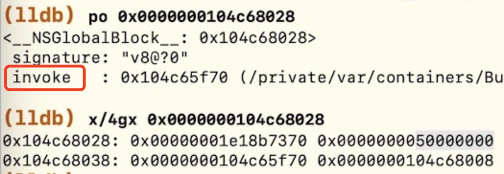

# Block心得

TODO：

* 【已解决】Xcode中lldb调试遇到Block类型变量`__NSMallocBlock__`
* 【整理】iOS的ObjC的Block函数：_Block_object_dispose
* 【整理】IDA使用心得：根据函数列表可以找到iOS的ObjC的Block的回调函数
* 【整理】iOS逆向心得：Block被调用时的函数参数
* 特殊情况
  * 嵌套调用
    * 【整理】iOS逆向心得：Block嵌套调用举例
  * Block中调用其他Block
    * 【整理】iOS逆向心得：Block函数中调用引用变量中的其他Block函数

---

## 有些Block只有invoke，没有copy和dispose

举例：

是正常的，因为此时：

`BLOCK_HAS_COPY_DISPOSE = 0`

表示没有`copy`和`dispose`
